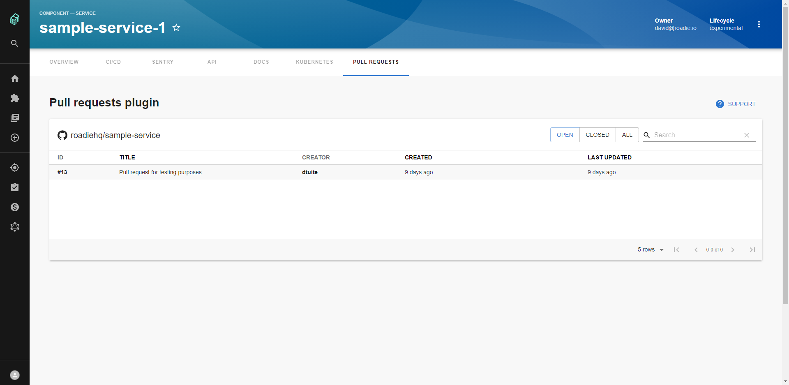
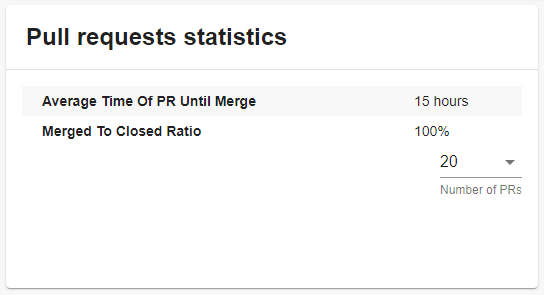
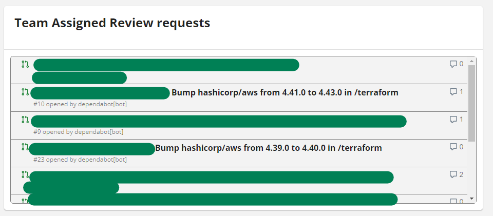

# GitHub Pull Requests Plugin for Backstage



## Features

- List Pull Requests for your repository, with filtering and search.
- Show basic statistics widget about pull requests for your repository.
  - Average time of PR until merge
  - Merged to closed ratio
  - Average size of PR (the average lines of changes in the PR)
  - Average amount of file changed in a PR
- It has two homepage plugin componenets
  - Review requests
  - Open pull requests

## Plugin Configuration Requirements

This plugin relies on the [GitHub Authentication Provider](https://backstage.io/docs/auth/github/provider) for its access to GitHub.

Search filter works the same way it works in GitHub, but `roadie-backstage-pull-requests/default-filter` annotation needs to be provided in component configuration. Adding a filter will result in applying that filter per default.

If this annotation is left out, no default filter will be applied when running the app.

## Install the plugin

```bash
cd packages/app
yarn add @roadiehq/backstage-plugin-github-pull-requests
```

## Add plugin API to your Backstage instance:

```ts
// packages/app/src/components/catalog/EntityPage.tsx
import {
  EntityGithubPullRequestsContent,
  isGithubPullRequestsAvailable,
} from '@roadiehq/backstage-plugin-github-pull-requests';
...

const serviceEntityPage = (
  <EntityLayout>
    ...
    <EntityLayout.Route
      path="/pull-requests"
      title="Pull Requests"
      // Uncomment the line below if you'd like to only show the tab on entities with the correct annotations already set
      // if={isGithubPullRequestsAvailable}
    >
      <EntityGithubPullRequestsContent />
    </EntityLayout.Route>
    ...
  </EntityLayout>
```

4. Run backstage app with `yarn start` and navigate to services tabs.

## Widget setup



1. You must install plugin by following the steps above to add widget to your Overview

2. Add widget to your Overview tab:

```ts
// packages/app/src/components/catalog/EntityPage.tsx
import { EntityGithubPullRequestsOverviewCard, isGithubPullRequestsAvailable } from '@roadiehq/backstage-plugin-github-pull-requests';

...

const overviewContent = (
  <Grid container spacing={3}>
    ...
    <EntitySwitch>
      <EntitySwitch.Case if={isGithubPullRequestsAvailable}>
        <Grid item md={6}>
          <EntityGithubPullRequestsOverviewCard />
        </Grid>
      </EntitySwitch.Case>
    </EntitySwitch>
    ...
  </Grid>
);

```

## Group Widget setup



1. You must install plugin by following the steps above to add widget to your Group Entity Page

2. Add widget to your group page:

```ts
import {
  EntityGithubGroupPullRequestsCard,
  isGithubTeamPullRequestsAvailable,
} from '@roadiehq/backstage-plugin-github-pull-requests';

...

const groupPage = (
  <Grid container spacing={3}>
    ...
    <EntitySwitch>
      <EntitySwitch.Case if={isGithubTeamPullRequestsAvailable}>
        <Grid item md={5} xs={12}>
          <EntityGithubGroupPullRequestsCard/>
        </Grid>
      </EntitySwitch.Case>
    </EntitySwitch>
    ...
  </Grid>
);

```

## Add Homepage components to your homepage


If you didn't set up the HomePage plugin you can see the official documentation about it [here](https://github.com/backstage/backstage/tree/master/plugins/home). You'll need to have it setup to be able to include this plugin.

A reasonable default will be used as a search term for both cards but you may have reasonable to provide your own query. This can be done through the `query` prop available for both cards.

**TIP**: You might want to filter by a specific Github org if you have users who share a single Github account for work and personal usage.

You can build up a query using [Github Advanced Search](https://github.com/search/advanced) and once you hit "Search", the query in the search bar is what you'll want to provide as your query prop.

```tsx
//packages/app/src/components/home/HomePage.tsx

import {
  HomePageRequestedReviewsCard,
  HomePageYourOpenPullRequestsCard,
} from '@roadiehq/backstage-plugin-github-pull-requests';


export const HomePage = () => {
  return (
    ...

      <Grid item md={6} xs={12}>
        <HomePageRequestedReviewsCard />
      </Grid>

      <Grid item md={6} xs={12}>
        <HomePageYourOpenPullRequestsCard query="org:RoadieHQ is:pr language:CSS" />
      </Grid>
    ...
  );
};
```

## Features

- List Pull Requests for your repository, with filtering and search (The searchbar is working like in github).
- Show basic statistics widget about pull requests for your repository.
- Possibility to add a variable on the backstage configuration of a catalog entity allowing to add a default search filter on github pull requests

## Links

- [Backstage](https://backstage.io)
- Get hosted, managed Backstage for your company: https://roadie.io
